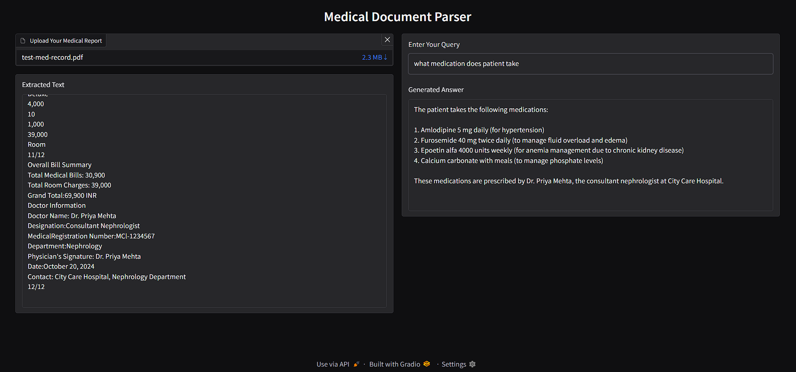

# Automated_Health_Document_Parsing_and_Query_Resolution_System

 

The system is designed to process medical documents that include both textual and visual data. It employs OCR to extract critical information from the documents. Utilizing the Ollama Llama 3.2 model, it facilitates query-based information retrieval, enabling users to ask questions and receive precise answers derived from the extracted content.

# DEMO
<div style="display: flex; justify-content: center; align-items: center; height: 100vh;">
  
</div>

# Getting Started:

-[Download OLLAMA for Windows](https://ollama.com/download/windows)

-After downloading , follow these steps to initialize and prepare the model:
-Open the OLLAMA Command Prompt.

-Run the following commands to download the model:
```bash
ollama pull llama-3.2
```

# Running the System:
To run the system execute  the following commands:

```bash
python -m pip install -r requirements.txt
streamlit run app.py


 


